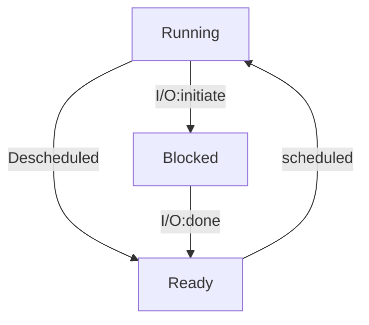

# 概述

# 1.4 Process

## 问题：既然物理CPU的数量是有限的，那么操作系统是怎么实现提供几乎无限的所谓的CPU呢？

操作系统通过虚拟CPU来实现无限的CPU。通过运行一个process，然后停止这个process并且运行另一个process，如此，操作系统可以在只有一个物理CPU的条件下创造许多虚拟CPU。这样的技术被称为Time sharing of the CPU （时间共享CPU），允许用户同时运行多个process。

## Time sharing

Time sharing 是一种用来共享资源的技术，通过允许资源被一个process占据一段时间，然后被另一个process占据一段时间，如此继续。

## Space sharing

与time sharing类似，用于disk。

## Process API

- Create：操作系统从disk读取program到Memory
- Destroy
- Wait：有的时候需要等待一个process结束
- Miscellaneous Control：除了杀掉或者等待一个process，有的时候需要暂停一个process，并且之后再重新运行process
- Status：有关process的信息

## Process Status

一个process可以从running开始运行，并且调用I/O时Blocked，此时运行此process的processor运行其他process，等到I/O完成时，Blocked的process处于ready状态等待processor调用。

举例：

| Time | Process0 | Process1 |         Notes          |
| :--: | :------: | :------: | :--------------------: |
|  1   | Running  |  Ready   |                        |
|  2   | Running  |  Ready   |                        |
|  3   | Blocked  | Running  | Process0 initiates I/O |
|  4   | Blocked  | Running  |                        |
|  5   |  Ready   | Running  |        I/O done        |
|  6   |  Ready   | Running  |                        |
|  7   | Running  |    -     |                        |

# 1.5 Practical: Process API

## Fork()

# 1.6 对于程序运行的限制(Limited Direct Execution)

为了虚拟化(virtualize)CPU，操作系统需要在众多任务中共享CPU，基本思想是：**先跑一个process，然后换一个跑，如此交替**。当然这引发了很多挑战，包括**性能**、如何在运行Process的时候保持对CPU的控制，等等。

## 受限的直接运行（Limited Direct Execution）

direct execution 顾名思义就是直接在CPU上运行程序。也就是说当操作系统希望一个程序(program)开始运行时，会在process list中创造一个process entry(就相当于一个节点，包含process有关的信息)，并为process分配内存，然后从硬盘(disk)中读取程序到内存中 ，定位到程序的入口点（entry point ,也就是main() ），跳转到该入口点并开始运行用户代码。来看下面的例子：

## 受限的操作（Restriced Operations）

在CPU直接运行process的性能很快，但是也有一些问题，比如当process想要执行一些受限的操作，例如发起**I/O请求**或请求获得更多的系统资源。当然不能让process随心所欲，毕竟让一个process能够随意读写整个硬盘是一件十分危险的事情！

因此我们采用的方法是引入一种新的处理器（processor）模式，叫用户模式（user mode）。在这种模式下运行的程序所能做的操作时受限制的，例如不能发起IO请求；如果这么做了，那么会引发处理器异常，操作系统会杀死这个进程。

相反的，也有**内核模式（kernel mode）** ，操作系统就运行在这种模式之下。在内核模式下，一个process可以做所有事情。

那么问题来了，当一个处于用户模式下的进程想要执行一些受限的操作时该怎么办？为了实现这一点，几乎所有现代硬件都为用户程序提供了**系统接口（system call）**。为了执行系统调用，一个程序必须执行特殊的**trap instruction**(陷阱指令？反正就是跳转到系统接口，在此之前先在栈中存储当前进程的所有信息)。这条指令会跳转到内核，此时进入内核模式，执行所需要的操作，完成后再通过**return-from-trap**指令回到用户程序，此时是用户模式。那么process怎么知道该去哪调用系统接口？

在kernel启动时会配置一个**trap table**（就是系统接口的表格，包含系统接口的地址和代号等等）。因为当机器启动时是处于内核模式下的，因此可以做这些必要的事情。操作系统会告诉硬件当发生一些异常事件时该怎么做，例如发生了键盘中断或当一个程序试图发起IO请求，等等。操作系统会告诉硬件这些**trap handlers**的位置。

系统接口一般都有特定的代号（**System call number**），用户程序会把想要调用的系统接口代号放到特定的寄存器中或者栈中，然后操作系统会检查这个代号是否合法，并在trap handler里处理系统调用。进行这样的操作是为了安全性。

具体如下：

## 在processes之间切换

当一个Process运行时就意味着操作系统没有运行，那么如果process不发起系统调用请求，如何将控制权还给操作系统手中呢？

答案是使用**timer interrupt**，也就是说隔几毫秒就发起一次中断，当中断发起时，process会被停止，此时先前设定好的**interrupt handler**会开始运行，操作系统会重新获得CPU的控制权，并且运行另一个process。为了实现这一点，在启动时操作系统必须告诉硬件当timer interrupt发生时该运行什么代码，并且启动timer，这样操作系统就会不断获得对CPU的控制！当然timer也可以被操作系统关闭。

### 保存并恢复process

#### context switch

操作系统保存当前process相关联的寄存器到此Process的kernel stack中，然后把另一个process的kernel stack中的值复制到寄存器中。

这一部分没什么好说的，就是替换寄存器值的过程，可以参考软硬件接口Procesdure那一部分，这里只是交换了两个Process的寄存器值而已，具体过程如下：

x86汇编代码如图：

## interrupt并发

如果在处理一个interrupt时另一个interrupt发生怎么办？请见下一部分：Concurrency。

# 1.7 Scheduling: Introduction

## 负载假设

将运行在系统的process统称为负载(workloads)，首先做如此理想情况下的假设：

1. 每个job都运行同样长的时间
2. 所有jobs都在同一时间到达
3. 一旦开始运行，所有job都将运行到结束(即不存在丢失)
4. 所有jobs都只使用CPU
5. 每个Job的运行时间都是已知的

这些假设都是理想情况的，后面会逐步修改这些假设到一般情况

## 调度指标（Scheduling Metrics）

### turnaround time (周期时间)

turnaround time定义为job完成的时间（时间点）减去job到达的时间。即:
$$
T_{turnaround}=T_{completion}-T_{arrival}
$$
当然这只是一种指标，后面还会继续介绍。

## First in, First out (FIFO)

首先来看最基础的一种数据结构：队列。也就是谁先到就先运行谁！

假设有三个job同时到达系统，仅有一点点偏差，但是还是将到达时间都认为是T=0，并且每个job都运行10s，那么平均turnaround time会是多少？具体请看：

那么$T_{turnaround\_average}=\frac{10+20+30}{3}=20$ 。

接下来我们放宽理想假设1，也就是三个Job的运行时间并不相同。这里假设此时A需要运行100s，B和C需要10s，此时：

此时$T_{turnaround\_average}=\frac{100+110+120}{3}=110s$ ，这显然是不太高效的，因为一些较短的任务被较长的任务一直阻塞！

## Shortest Job First (SJF)

SJF指先运行那些运行时间短的任务，还是看上一个例子，在这种方法下：

此时$T_{turnaround\_average}=\frac{10+20+120}{3}=50$，高效了很多！

但是如果A,B,C不是同时到达呢！继续放宽理想假设2，假设A在T=0到达，B和C在T=10到达，尽管只相差了10s，但是B和C任然需要等待A完成！这显然是低效的。

此时$T_{turnaround\_average}=\frac{100+(110-10)+(120-10)}{3}=103.33$。

## Shortest Time-to-Completion First (STCF)

为了解决上面的问题，我们放宽理想假设3，也就是说任务不一定需要一直运行到完成，可以被中断。

STCF(又叫Preemptive Shortest Job First, PSJF)，在有新任务抵达时会检测所有任务 （包括新任务）所需的剩余时间，以此来重新调度任务。来看上面的例子，此时：

$T_{turnaround\_average}=\frac{(120-0)+(20-10)+(30-10)}{3}=50s$ ，显然更加高效。

## 新的指标：响应时间（Response Time）

# 1.8  多级反馈队列（Scheduling: The Multi-Level Feedback Queue)

